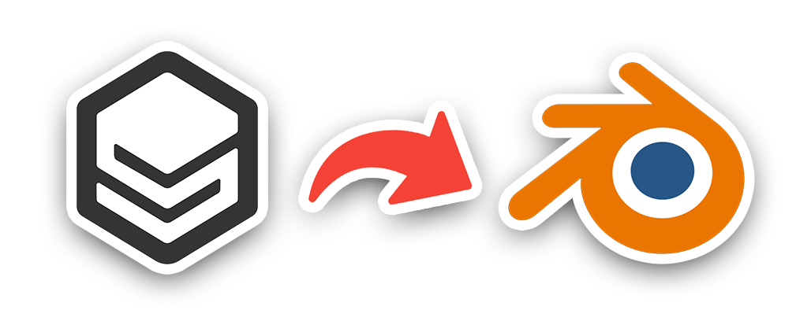

# Synty in Blender Project

  

The Synty in Blender Project has two main goals:

1. Provide a one-click import into Blender where possible for each Synty pack.
1. Store assets for every pack in a consistent set of collections.

At the time of writing I'll just be focusing on character imports but ideally this will expand into all other assets.

**No Synty assets are distributed in this repo. They can be purchased from the [Synty store](https://syntystore.com).**

## Installation

* Download and extract the source files zip from your Synty vault.
* Drop *POLYGON.blend* into the folder you just extracted. i.e if you extraced the City Characters zip, drop the file in your *POLYGON_CityCharacters_SourceFiles* folder.
* Open the relevent python script from this repo for the pack you're working with and copy its contents.
* Open the blend file, navigate to the *Scripting* tab at teh top, click *New*, paste and hit *Run Script*.

> Note: The scripts aren't set up to import multiple packs into the one blend file. You'll need a separate blend file per pack.

## Notes

All packs will be imported into the following Collections:
* Characters
* Character_Attachments
* Buildings
* Environments
* Props
* Vehicles
* Weapons

All assets will have scale and rotation applied.

Characters will have all meshes under one armature.

## Disclaimer

I'm not affiliated with Synty in any way. I just want a consistent Blender setup with their content.

## License

MIT